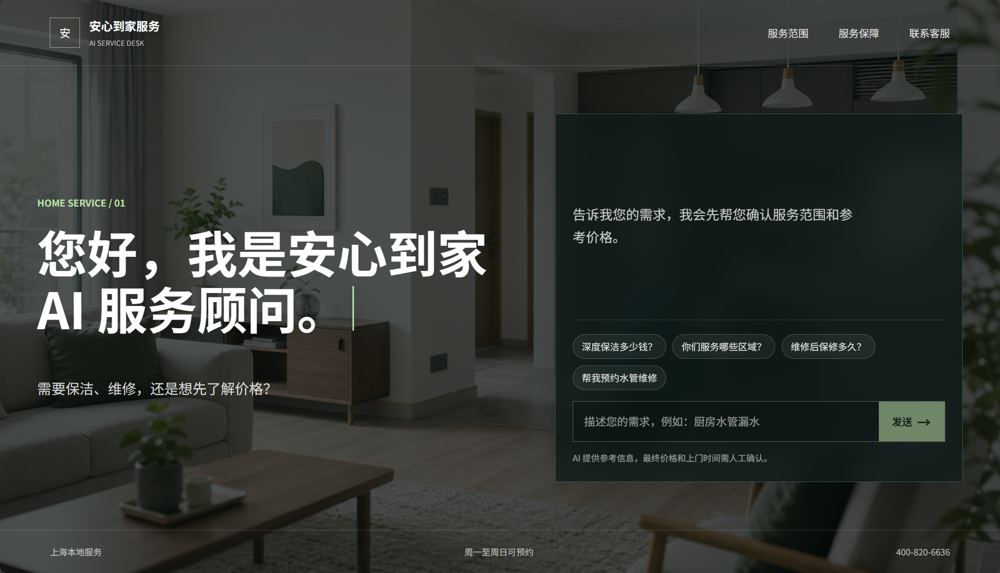
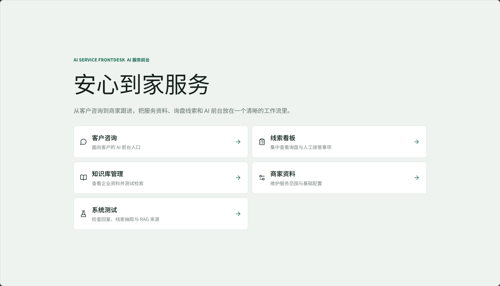
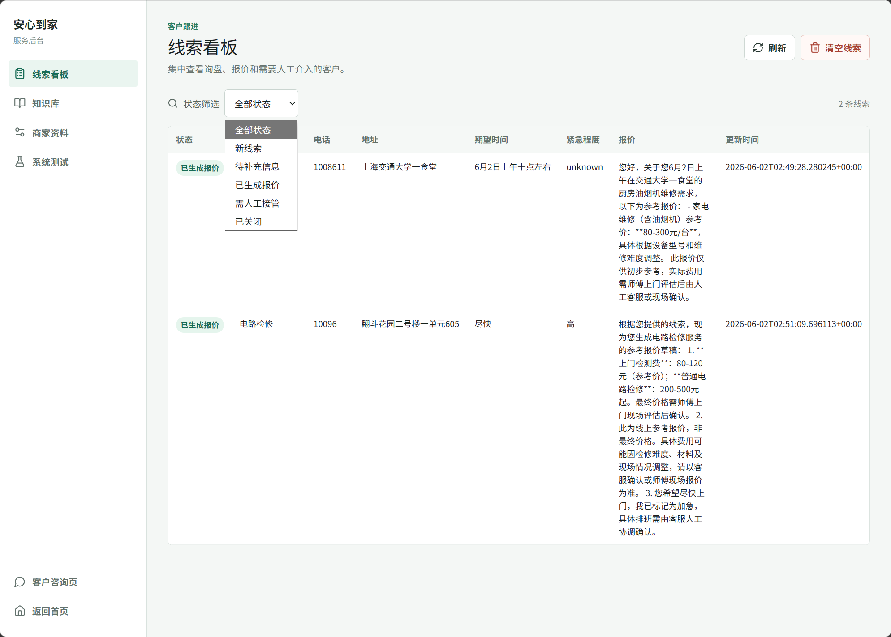

# AI Service Frontdesk

AI Service Frontdesk 是一个面向本地生活服务商家的 AI 前台应用。它可以结合企业知识库回答客户问题，收集服务需求，追问缺失信息，生成参考报价，并将询盘保存为待跟进线索。

项目使用 React、FastAPI、LangGraph 和 LangChain 构建。配置 DeepSeek API 后，对话流程会优先调用大模型；未配置 API Key 时，内置规则和本地 RAG 检索仍可支持基础演示。

## Interface Preview

### Customer Chat



### Home Dashboard



### Leads Board



## Project Structure

```text
.
├── app.py
├── graph.py
├── prompts.py
├── schemas.py
├── storage.py
├── backend/
│   ├── __init__.py
│   ├── api.py
│   └── api_test.py
├── requirements.txt
├── .env.example
├── data/
│   ├── business.json
│   └── leads.json  # Generated locally at runtime and not committed
├── knowledge/
│   ├── company.md
│   ├── pricing.md
│   ├── staff.md
│   ├── service_policy.md
│   └── faq.md
└── AI_FRONTDESK_PROJECT_PLAN.md
```

## Conda Environment

Create and activate a fresh environment:

```bash
conda create -n ai-frontdesk python=3.11 -y
conda activate ai-frontdesk
```

If the environment already exists, activate it directly:

```bash
conda activate ai-frontdesk
```

## Install Dependencies

```bash
pip install -r requirements.txt
```

Core dependencies:

- `streamlit`
- `langgraph`
- `langchain`
- `langchain-openai`
- `pydantic`
- `python-dotenv`
- `fastapi`
- `uvicorn`
- `httpx`

## Environment Variables

Copy the example file:

```bash
copy .env.example .env
```

Then edit `.env`:

```bash
DEEPSEEK_API_KEY=your_deepseek_api_key_here
DEEPSEEK_BASE_URL=https://api.deepseek.com
DEEPSEEK_MODEL=deepseek-v4-flash
```

Do not commit `.env`. The repository ignores this file by default. If `DEEPSEEK_API_KEY` is not configured, the app should still be able to use the built-in fallback flow for basic demo scenarios. `OPENAI_API_KEY` remains optional for the legacy chat fallback and OpenAI embedding mode; local keyword RAG works without it.

## Start The App

```bash
streamlit run app.py
```

Open the local URL shown by Streamlit, usually:

```text
http://localhost:8501
```

## Start The FastAPI Backend

Activate the environment and start the API server:

```bash
conda activate ai-frontdesk
uvicorn backend.api:app --reload --port 8000
```

The React/Vite development frontend currently uses `http://localhost:5174` because port `5173` is already occupied by another local project. Both origins are allowed by CORS.

Start the React frontend in another terminal:

```bash
cd frontend
npm install
npm run dev -- --host 0.0.0.0 --port 5174
```

Open:

```text
http://localhost:5174
```

Available endpoints:

- `GET /api/health`
- `POST /api/chat`
- `GET /api/leads`
- `DELETE /api/leads`
- `GET /api/business-profile`
- `PUT /api/business-profile`
- `GET /api/knowledge/status`
- `POST /api/knowledge/rebuild`
- `GET /api/knowledge/files`
- `GET /api/knowledge/files/{filename}`
- `POST /api/knowledge/search`

Run the API smoke tests:

```bash
conda run -n ai-frontdesk python -m py_compile backend/api.py backend/api_test.py
conda run -n ai-frontdesk python backend/api_test.py
```

## Demo Test Scripts

Use these customer messages to verify the MVP flow.

### Plumbing Inquiry

```text
我家厨房水管漏水，明天上午能来修吗？
```

Expected behavior:

- Recognizes a repair inquiry.
- Asks for missing address, phone number, and issue details.
- Creates or updates a lead.
- Generates a reference quote after enough details are available.

### Deep Cleaning Inquiry

```text
你们周末能做深度保洁吗？大概 90 平。
```

Expected behavior:

- Recognizes a cleaning inquiry.
- Asks for address, preferred time, and contact details.
- Generates a reference quote based on pricing rules.

### Complaint / Handoff

```text
刚才维修师傅把我家弄坏了，我要投诉。
```

Expected behavior:

- Does not continue quoting.
- Flags the lead for human handoff.
- Responds with a concise handoff message.

## Knowledge Base Documents

The `knowledge/` folder contains short, structured Markdown files for the demo company `安心到家服务`.

- `knowledge/company.md`: company address, hours, service area, service scope, and AI boundaries.
- `knowledge/pricing.md`: reference service prices and pricing rules.
- `knowledge/staff.md`: customer service staff, technicians, specialties, and dispatch limits.
- `knowledge/service_policy.md`: appointment, after-sales, cancellation, complaint, and safety policies.
- `knowledge/faq.md`: retrieval-friendly frequently asked questions.

These documents are indexed and queried by `rag.py`. The FastAPI adapter exposes knowledge status, rebuild, file reading, and search endpoints.

## Notes For Multi-Process Development

- Do not change unrelated modules while working as a sub-process.
- Update `AI_FRONTDESK_PROJECT_PLAN.md` after completing a module.
- Keep the file encoding as UTF-8. If Chinese text looks garbled in a terminal, first check the terminal encoding before rewriting the file.
